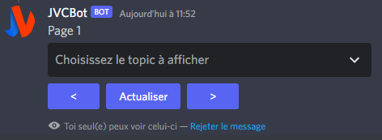
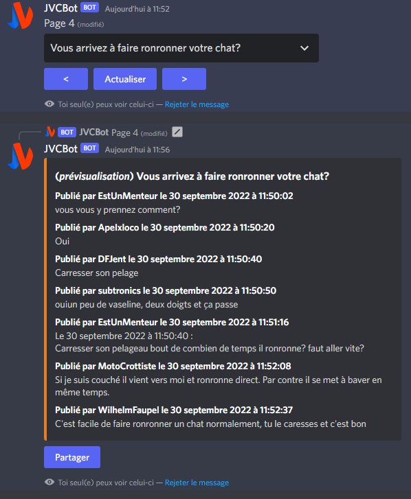
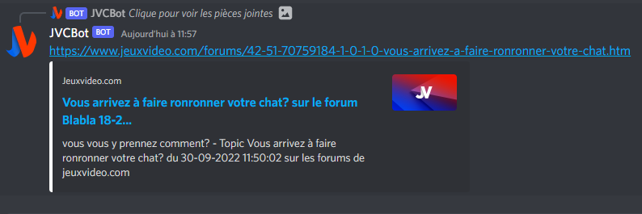

# JVCBot

Bot Discord permettant d'interagir avec les topics du forum Blabla 18 - 25 ans

## Pré-requis

- Python 3.9.13 ou plus
- Avoir créé une application sur le [Discord Developer Portal](https://discord.com/developers/applications) et récupéré le token associé

## Installation

Ajouter le token dans le fichier .env présent dans le dossier main, puis exécuter la commande :
```bash
python -m pip install -r requirements.txt 
```

## Lancement

```bash
python main/bot.py
```

## Illustrations

- Utilisation de la commande /topics



- Affichage d'un topic



- Partage du topic dans un salon

